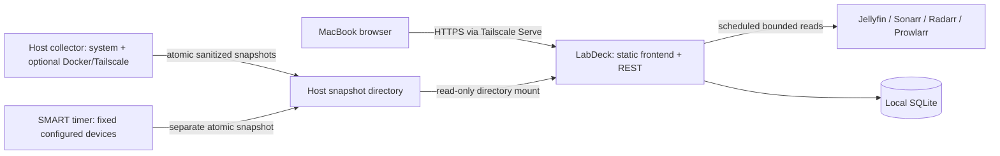

# Architecture

Status: accepted baseline, updated through the M4 implementation on 2026-09-23. Later-milestone code/module names remain proposed until their slice begins.

## System shape

Use a modular monolith: a React/TypeScript frontend and a TypeScript Fastify backend shipped as one container, with SQLite on a local persistent volume. A small Go host collector runs under systemd outside Docker. It is a privilege boundary, not a general agent platform. It publishes files; it has no listening socket or command API.



Default access: host Tailscale Serve terminates HTTPS and proxies to the app's loopback-published port. Keep built-in single-owner login. No Funnel. LAN access uses an explicitly configured TLS reverse proxy; binding to all interfaces is not the default. LabDeck does not require the Tailscale integration to use this access path. Plain HTTP development is loopback-only.

## Technology choices

| Concern | Choice | Reason |
| --- | --- | --- |
| UI | React, TypeScript, Vite, React Router | SPA fits a private dashboard; no SSR requirement |
| Components | Radix primitives, owned components, CSS variables/CSS modules, Lucide icons | Accessible foundations and restrained design without a large design-system project |
| Client data | TanStack Query; same-origin REST | Cached reads, predictable error/retry behavior |
| Charts | Small SVG sparklines; one lightweight chart dependency only if detailed charts justify it | Avoid shipping a visualization platform |
| Server | Node 24 LTS baseline, Fastify 5, TypeScript | Shared contracts and simple deployment; recheck supported patch releases at M1 |
| Validation | Zod contracts; explicit serialization DTOs | Validate upstream/collector input and prevent raw data leakage |
| Persistence | SQLite, better-sqlite3, SQL migrations | Single writer and modest bounded datasets; no ORM/service required |
| Host collection | Go binary plus systemd units | Simple Linux distribution, bounded subprocesses, native counters without Node on the host |
| Tooling | npm workspaces, ESLint, TypeScript, Vitest, Playwright; Go test | Few tools, reproducible lockfile and CI |

Dependency versions are pinned during M1 after compatibility checks. Validate native SQLite builds on linux/amd64 and linux/arm64. Go for the whole backend would simplify binaries but add contract generation across all UI features; Python is workable but adds a runtime/type boundary without a clear benefit here. A second language is justified only for the small host helper. See [decision 001](docs/decisions/001-stack-and-boundaries.md).

## Ownership and data flow

Adapters own vendor authentication, endpoint mapping, pagination, and parsing. A central scheduler owns polling, cancellation, backoff, timestamps, and concurrency. The state service validates and atomically persists normalized observations, metrics, cursors, and events. Query services build public DTOs from cached state. The frontend never talks to integrations or a host collector.

Adapters have no access to database internals or frontend code. Domain types are independent of vendor DTOs. UI feature modules can depend on typed capability payloads, not provider-specific raw responses. A static adapter registry is sufficient; no runtime plugins or dependency-injection framework.

See [provider contract](docs/integrations/contract.md) for the precise boundary, health model, polling behavior, units, and deduplication rules.

## REST boundary

Version routes under `/api/v1`. Planned authenticated GET endpoints:

- `/overview`: compact aggregate, warnings, summary cards and recent activity; maximum 256KiB.
- `/system`: cached host summary plus bounded 1h/24h metric projections; introduced in M2 as a page-shaped read model.
- `/storage`: cached selected-filesystem state plus bounded 1h/24h used-capacity projections; introduced in M2 as a page-shaped read model.
- `/integrations`: configured integration state and capability/freshness metadata, no credentials or secret references.
- `/integrations/:id/:capability`: normalized cached detail; identifiers must resolve in the static configuration, never become URLs.
- `/metrics`: registered series ID(s), UTC time range, resolution; maximum 20 series, 1,000 points each, 400 days, and bounded response bytes.
- `/events`: severity/integration filters and opaque cursor; default 50, maximum 100 entries, sorted by observed time plus ID.
- `/settings`: sanitized configuration summary, versions, collector compatibility and retention diagnostics; read-only.

Authentication is limited to `/session` POST/DELETE and `/session` GET. No integration mutation or arbitrary proxy route. Public `/health/live` exposes only process liveness; `/health/ready` only a boolean readiness result. Database failure affects readiness, upstream outages do not. Login uses a per-browser CSRF mechanism described in decision 002.

Browser polling: overview every 5s while visible, detail 10–30s, stop while hidden and refetch on focus. Server polling runs independently. REST is sufficient; SSE/WebSockets are deferred. All API responses containing personal or operational state use `Cache-Control: no-store`; client cache is memory-only.

## Persistence

One app instance and one SQLite writer. Enable foreign keys, WAL and a 5s busy timeout; use short transactions, bounded batches, and scheduled checkpoints. Keep the database on local ext4/xfs or another verified local filesystem, not NFS/SMB. WAL requires shared local coordination; see [SQLite WAL documentation](https://www.sqlite.org/wal.html).

Planned schema (migration 001 introduces only the subset needed by M1/M2):

| Table | Key fields / purpose |
| --- | --- |
| schema_migrations | version, applied_at |
| integration_state | instance_id PK, config_revision, connection, attempted_at, succeeded_at, safe_error_code |
| capability_state | instance_id + capability PK, schema_version, observed_at, succeeded_at, normalized JSON, supported state |
| poll_state | instance_id + group PK, cursor JSON, last successful group time, persisted event baseline |
| metric_series | series_id PK, instance_id, entity_id, metric name, unit, sampling class; unique identity tuple |
| metric_buckets | series_id + resolution + bucket_start PK, count, expected_count, sum, min, max, last, last_at |
| events | id PK, instance_id, entity_id, kind, severity, occurred_at nullable, observed_at, dedupe_key UNIQUE, safe typed payload |
| sessions | hash of random session token, created_at, expires_at; never the raw token |

Times are UTC integer milliseconds in storage and ISO 8601 UTC in REST. Bytes and rates use numeric values only within JS safe integer range; oversized hardware counters cross the collector boundary as decimal strings and are differenced safely before presentation.

Keep full-resolution observations in current state only. Accumulate 1-minute metric buckets for 48h, roll to 15-minute buckets for 30d and 1-hour buckets for 400d. Rollups merge count/sum/min/max/last, never average averages. Missing samples remain gaps; record coverage. Slow series such as temperatures and library counts retain their real sample count; do not pretend they were observed every minute. Chart buckets can show the last point with its age, but do not forward-fill analytical data. Rates are computed before aggregation.

Start with a maximum of 400 retained series; default per-container history is off (current statistics still available). Operator configuration enables selected container series within the cap. Retain events for 90d or 50,000 rows, whichever is reached first; suppress repetitive errors. Apply retention hourly in bounded batches. At 1GiB DB+WAL target, shorten oldest history with a visible diagnostic; at 2GiB or <512MiB filesystem headroom, stop telemetry writes and surface persistence degraded while serving cached state. Enforce bounded WAL checkpoints and queue length (1,000 batches; coalesce metric updates before dropping them). These thresholds are conservative defaults, to measure in M8, not a promise of constant file size. DELETE frees pages for reuse; schedule incremental vacuum and verify actual disk behavior.

Persistence failures must not crash collection or falsely mark a successful durable write. Last good in-memory state remains available; show history unavailable. Startup migration failure stops readiness and polling; never silently create a replacement empty database.

Backups use SQLite's online backup API into a separate target, followed by integrity verification. Do not copy a live DB file without its WAL coordination. Back up configuration separately and secrets through the owner's chosen secure mechanism. Restore with app stopped, verify schema/integrity, clear sessions, then start the matching app version. No automatic down-migrations; retain the pre-upgrade backup.

## Planned repository structure

Introduce these paths only when their milestone needs them. M1 and M2 paths now exist; later integration paths remain illustrative:

```text
apps/
  web/src/
    app/                  # routing and shell
    components/           # owned accessible primitives, status and charts
    features/             # overview, media, downloads, containers, system, storage, network, events
    styles/               # tokens and global layout
  server/src/
    auth/ config/ http/   # session security, secret loading, REST DTOs
    core/                 # scheduler, state, health, metrics, events
    integrations/         # jellyfin, arr/common, sonarr, radarr, prowlarr, host
    db/                   # queries, migrations, retention, backup
packages/contracts/src/   # public DTOs, normalized capabilities, collector schema
collector/
  cmd/labdeck-collector/  # host snapshots and separate SMART mode
  internal/              # system, docker, tailscale, smart, snapshots
  testdata/              # sanitized Linux/vendor fixtures
deploy/
  compose/               # app example and local secret/config examples
  systemd/               # unprivileged collector and optional SMART timer
tests/
  fixtures/              # redacted upstream data + compatibility metadata
  e2e/                   # browser journeys and failure scenarios
  live/                  # opt-in read-only verification, never default CI
scripts/                 # validation and release helpers only as needed
docs/
  product/ integrations/ decisions/ plans/
```

Imports flow from app features to contracts/core; contracts import no app implementation. Go validates the versioned collector schema through shared JSON fixtures rather than generated TS bindings. Tests generally live beside their modules; cross-boundary tests use `tests/`.

## Deployment and failure boundaries

The application container runs non-root with read-only root filesystem, temporary `/tmp`, all capabilities dropped, no-new-privileges, a writable data volume and read-only config/secret/snapshot mounts. No host PID/network namespace is required. Use explicit service network membership or configured host/LAN service addresses; `localhost` inside a container is not the Ubuntu host. Shared Docker networks allow outbound API access but do not imply safe ingress.

Compose installs the app only. Full monitoring also needs a deliberate host systemd installation with reviewed permissions. Offer a documented service-only mode rather than automatically escalating Docker permissions when the collector is unavailable. See [host collector](docs/integrations/host-collector.md) and [security decision](docs/decisions/002-security-and-operations.md).

Out-of-process host collection prevents a compromised web application from asking a privileged helper to run arbitrary commands. It does not make the collector harmless: Docker socket access remains powerful and SMART access remains elevated. Document and audit both.
